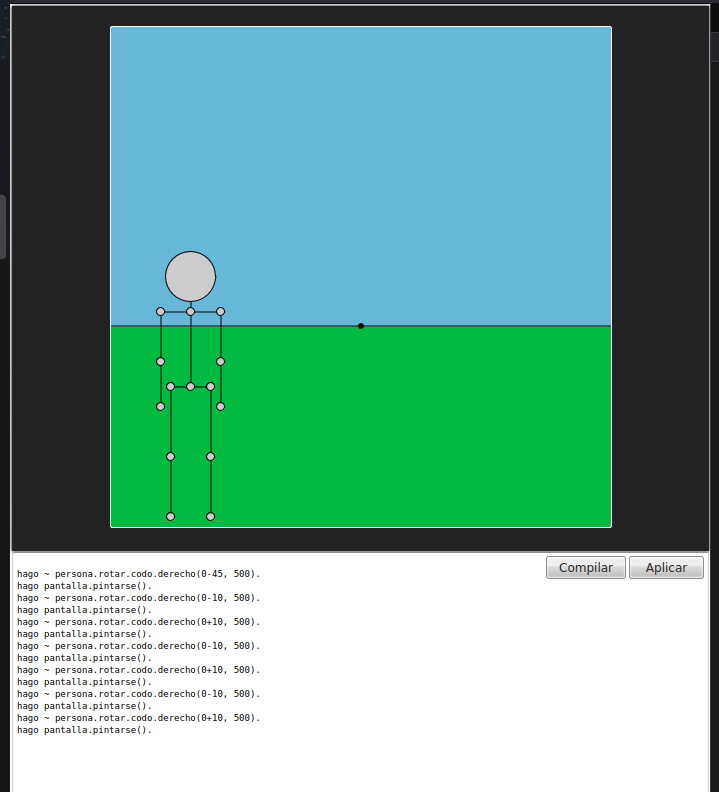

# homactógrafo de castelog

Homactógrafo en 2D con profundidad Z para Castelog.

## Versión online

[https://allnulled.github.io/constructor-de-homactogramas-de-castelog](https://allnulled.github.io/constructor-de-homactogramas-de-castelog)



## API

### Referencia

Desde scripts con `javascript`:

```js
const {
  utils: {
    Persona,
    Fondo,
    Pantalla
  },
  persona,
  fondo,
  pantalla
} = window.homactografo(document.getElementById("pre#salida"));
```

Desde el homactógrafo de `castelog` puedes acceder a estas variables directamente: `persona`, `fondo`, `pantalla` y `utils`.

Los métodos de persona de bajo nivel engloban las funciones que dan la orden de mover una articulación o mover el PaloMan por alguno de los ejes dimensionales (`x`, `y` y `z`).

Los métodos de persona de alto nivel engloban las funciones que dan la orden de hacer alguna acción, y que probablemente usen los métodos de persona de bajo nivel. Como métodos de alto nivel, de ejemplo, hay:

```calo
hago ~ persona.decir("Un diálogo anunciará esta acción.").
hago ~ persona.caminar(1,10,500,5,200).
```

Y de esa forma, conseguimos mover el monigote escribiendo solo 1 línea. Y así se pueden ir añadiendo métodos, y ampliar las capacidades de la `persona`: ampliando el `utils.clases.Persona.prototype` con métodos tipo prototipo.

### Referencia

| Propiedad de persona | Tipo | Unidad | Valor por defecto | Descripción |
|----|----|----|----|----|
| `pantalla` | `Object` | Instancia de `utils.Pantalla` | `{...}` | Pantalla principal vinculada. |
| `nombre` | `String` | Texto | `"persona aleatoria"` | Nombre representativo de la persona. |
| `estado_inicial` | `Object` | Objeto | `{...}` | Estado inicial de la instancia. |
| `restablecer` | `Object` | Objeto | `{...}` | Métodos de restablecimiento. |
| `restablecer.postura` | `Function` | Método | `function` | Restablece los valores respectivos a la postura. |
| `restablecer.estado` | `Function` | Método | `function` | Restablece todos los valores: de postura y de localización. |
| `x` | `Number` | Píxels | `80` | Píxels en el eje x. |
| `y` | `Number` | Píxels | `250` | Píxels en el eje y. |
| `z` | `Number` | Píxels de profundidad | `0` | Píxels en el eje z. |
| `largo_de_radio_de_cabeza` | `Number` | Píxels | `10` | Radio de la cabeza |
| `largo_de_cuello` | `Number` | Píxels | `10` | Largo del cuello |
| `largo_de_cadera` | `Number` | Píxels | `20` | Largo de cadera |
| `largo_de_espalda` | `Number` | Píxels | `30` | Largo de espalda |
| `largo_de_brazo` | `Number` | Píxels | `45` | Largo de brazo |
| `largo_de_antebrazo` | `Number` | Píxels | `50` | Largo de antebrazo |
| `largo_de_pierna` | `Number` | Píxels | `60` | Largo de pierna |
| `largo_de_antepierna` | `Number` | Píxels | `70` | Largo de antepierna |
| `largo_de_columna` | `Number` | Píxels | `75` | Largo de columna |
| `apertura_del_hombro_izq` | `Number` | Grados/360º | `0` | Apertura del hombro izquierdo |
| `apertura_del_hombro_der` | `Number` | Grados/360º | `0` | Apertura del hombro derecho |
| `apertura_del_codo_der` | `Number` | Grados/360º | `0` | Apertura del codo derecho |
| `apertura_del_codo_izq` | `Number` | Grados/360º | `0` | Apertura del codo izquierdo |
| `apertura_de_la_pierna_izq` | `Number` | Grados/360º | `0` | Apertura de la pierna izquierda |
| `apertura_de_la_pierna_der` | `Number` | Grados/360º | `0` | Apertura de la pierna derecha |
| `apertura_de_la_rodilla_izq` | `Number` | Grados/360º | `0` | Apertura de la rodilla izquierda |
| `apertura_de_la_rodilla_der` | `Number` | Grados/360º | `0` | Apertura de la rodilla derecha |

| Métodos de persona de bajo nivel | Parámetros | Descripción |
| ---- | ---- | ---- | 
| `persona.pintarse` | `-` | Método que pinta a la persona. Se debería usar solo el método `pantalla.pintarse`, y él llama a los `pintarse` de los demás objetos. | 
| `persona.trasladarse.por.eje.x` | `pixels, milisegundos=0, pintar_despues=0` | Incremento en el eje x. | 
| `persona.trasladarse.por.eje.y` | `pixels, milisegundos=0, pintar_despues=0` | Incremento en el eje y. | 
| `persona.trasladarse.por.eje.z` | `pixels, milisegundos=0, pintar_despues=0` | Incremento en el eje z. |
| `persona.posicionarse.por.eje.x` | `pixels, milisegundos=0, pintar_despues=0` | Asignación del eje x. | 
| `persona.posicionarse.por.eje.y` | `pixels, milisegundos=0, pintar_despues=0` | Asignación del eje y. | 
| `persona.posicionarse.por.eje.z` | `pixels, milisegundos=0, pintar_despues=0` | Asignación del eje z. |
| `persona.rotar.hombro.derecho` | `grados, milisegundos=0, pintar_despues=0` | Incremento del ángulo de la articulación específica. | 
| `persona.rotar.hombro.izquierdo` | `grados, milisegundos=0, pintar_despues=0` | Incremento del ángulo de la articulación específica. | 
| `persona.rotar.codo.derecho` | `grados, milisegundos=0, pintar_despues=0` | Incremento del ángulo de la articulación específica. | 
| `persona.rotar.codo.izquierdo` | `grados, milisegundos=0, pintar_despues=0` | Incremento del ángulo de la articulación específica. | 
| `persona.rotar.rodilla.derecha` | `grados, milisegundos=0, pintar_despues=0` | Incremento del ángulo de la articulación específica. | 
| `persona.rotar.rodilla.izquierda` | `grados, milisegundos=0, pintar_despues=0` | Incremento del ángulo de la articulación específica. | 
| `persona.rotar.pierna.derecha` | `grados, milisegundos=0, pintar_despues=0` | Incremento del ángulo de la articulación específica. | 
| `persona.rotar.pierna.izquierda` | `grados, milisegundos=0, pintar_despues=0` | Incremento del ángulo de la articulación específica. | 
| `persona.posicionar.hombro.derecho` | `grados, milisegundos=0, pintar_despues=0` | Asignación del ángulo de la articulación específica. | 
| `persona.posicionar.hombro.izquierdo` | `grados, milisegundos=0, pintar_despues=0` | Asignación del ángulo de la articulación específica. | 
| `persona.posicionar.codo.derecho` | `grados, milisegundos=0, pintar_despues=0` | Asignación del ángulo de la articulación específica. | 
| `persona.posicionar.codo.izquierdo` | `grados, milisegundos=0, pintar_despues=0` | Asignación del ángulo de la articulación específica. | 
| `persona.posicionar.rodilla.derecha` | `grados, milisegundos=0, pintar_despues=0` | Asignación del ángulo de la articulación específica. | 
| `persona.posicionar.rodilla.izquierda` | `grados, milisegundos=0, pintar_despues=0` | Asignación del ángulo de la articulación específica. | 
| `persona.posicionar.pierna.derecha` | `grados, milisegundos=0, pintar_despues=0` | Asignación del ángulo de la articulación específica. | 
| `persona.posicionar.pierna.izquierda` | `grados, milisegundos=0, pintar_despues=0` | Asignación del ángulo de la articulación específica. | 

| Métodos de persona de alto nivel | Descripción |
| ---- | ---- | 
| `persona.decir("Mensaje")` | Método para escribir por pantalla texto. | 
| `persona.caminar(direccion=1,distancia=50,milisegundos=1000,pasos=10,intensidad=20)` | Método para desplazar simulando movimiento. Si `direccion` vale `0` va a la izquierda, si vale `1` va a la derecha. La `distancia` son los píxeles del eje x. Los `milisegundos` es lo que quieres que dure todo el movimiento de caminar. Los `pasos` son el número de pasos que quieres que dé. La `intensidad` son los grados de ángulo que quieres que tenga al caminar. Un ángulo entre `10` y `45` será el razonable. | 

Los métodos `rotar` y `posicionar` hacen lo mismo, al igual que `trasladarse` y `posicionarse`: pero el primero de cada par incrementa el valor relativamente al actual, mientras que el segundo se basa en el valor directamente.

Las unidades siempre son:

  - o `pixels` (en el caso del eje z, píxels imaginarios que el homactógrafo se cuida de proyectar)
  - o `grados` de los de 360º
  - o `milisegundos` de los de 1000 = 1 segundo
  - o `pintar_despues` que es un `boolean` que en `true` pintará la pantalla.

